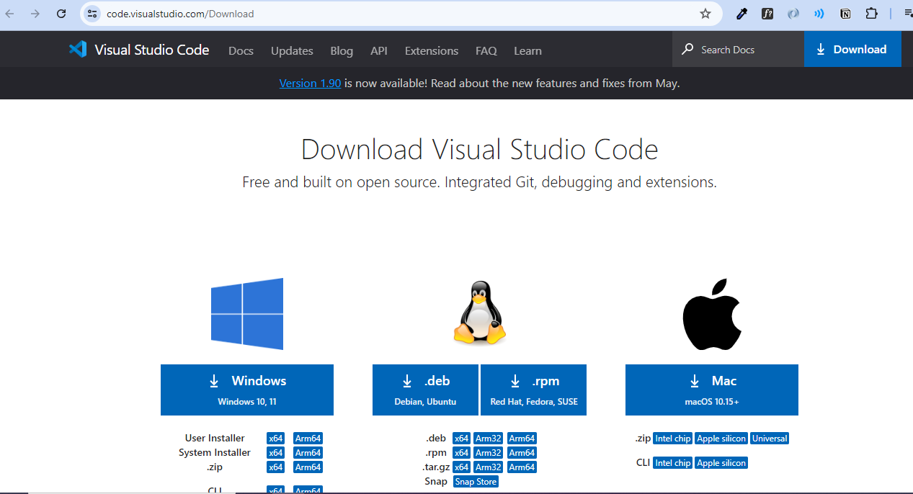
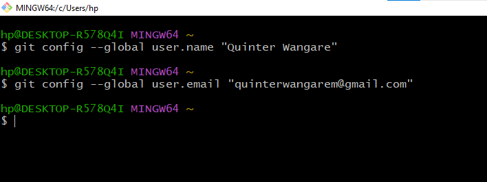
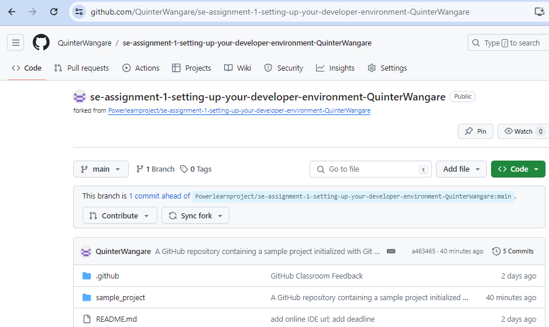
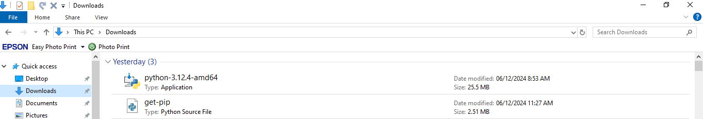
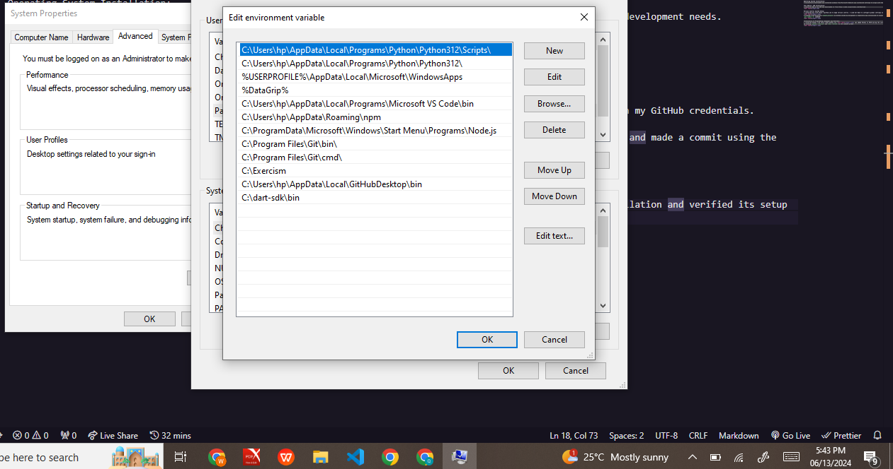
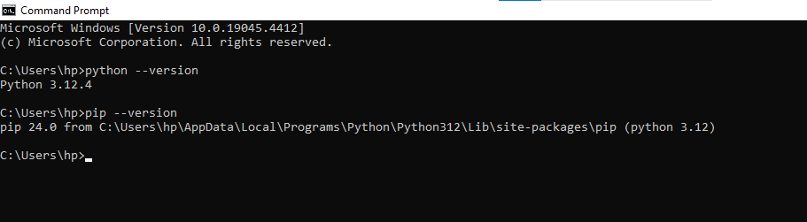
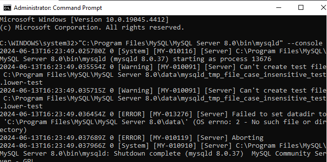

Introduction:
This document outlines the steps I took in setting up an efficient developer environment for Software Engineering projects. It includes installing Windows, Visual Studio Code as the IDE, Git for version control, Python for Programming, MYSQL for database management and Docker for virtualization.

1. Operating System Installation:
   I successfully downloaded and installed windows from Microsoft Website and customized settings to align with the development needs.

2. Text Editor/ IDE Installation:
   I chose VS Code as my IDE and downloaded it from https://code.visualstudio.com/Download
   

3. Version Control System Setup:
   I installed Git from https://github.com to mage version control. I used Git Bash to configure global settings with my GitHub credentials.
   
   I created a new directory `sample_project` on Github inside my Assignment 1 repository and initialized it locally and made a commit using the `git commit -m` command
   

4. Installation of Programming Languages and Runtimes:
   I installed Python from http://wwww.python.org  and added Python to PATH during the installation .
   I also verified its setup by running `python --version` and `pip --verson` in the command prompt.
   .

5. Package Managers Installation:
   I installed Pip as the package manager for Python.

6. Database (MySQL) Configuration:
   I downloaded and installed MYSQL from: https://dev.mysql.com/downloads/windows/installer/5.7.html for windows and configured the developer setup, set a root password and verified the installation by logging into MySQL command line.
   

7. Development Environments and Virtualization Setup:
   I installed Docker Desktop from https://docs.docker.com/desktop/install/windows-install/

8. Extensions and Plugins:
   I explored various VS Code extensions from the Extensions tab accessed by `ctrl+shift+x` command from which I intalled:
   Python extension
   Pylance
   Python Debugger
   Python Image Preview
   Matplotlib
   Code Runner
   Live Server
   Prettier

9. Sample Project Repository Setup:
   I created a new directory, sample_project inside my Assignment 1 repository which I earlier cloned usin the `git clone` command.
   I added a Documentation.md file and committed it with the `git add` and `git commit -m` commands then pushed the changes to my GitHub using the `git push origin main` command.

10. Challenges and Solutions:
    Challenge: MySQL Database configuration
    Solution: Followed the step-by-step guidelines from the class recordings on my LMS and utillized the MYSQL Installer documentation provided on the website.
